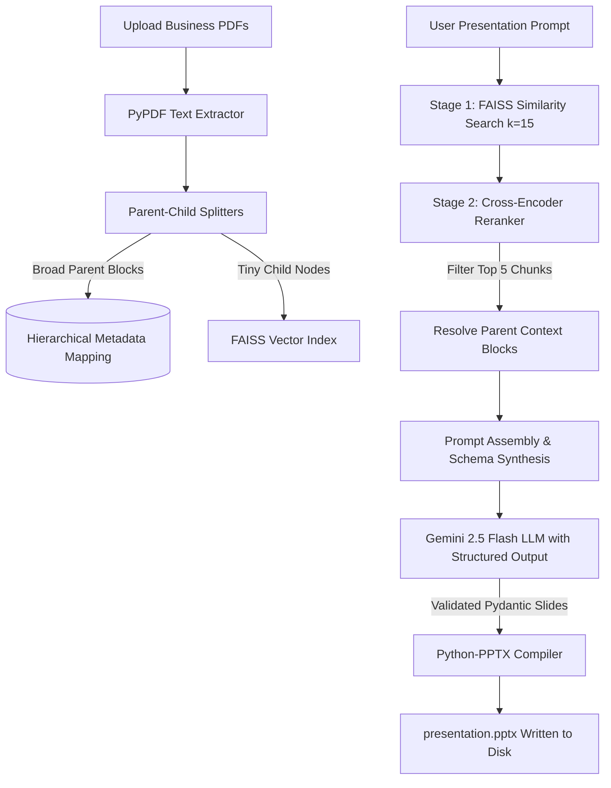

# Advanced RAG Slide Builder: Doc-to-Decks AI Workspace 📊🤖📚

An enterprise-grade, fully local **Advanced Retrieval-Augmented Generation (RAG)** pipeline that transforms dense corporate, business, or academic PDF reports into professional, structured presentation slide decks. 

By integrating multi-stage retrieval, local deep-learning rerankers, and mathematically constrained type-safe schemas, this application completely eliminates context fragmentation, LLM hallucinations, and file-parsing breaks.

---

## 🛠️ Complete Tech Stack

The application is built on a highly optimized, decoupled architecture separating heavy vector processing from the user presentation layer:

*   **Frontend UI:** **Streamlit** – Provides a sleek, responsive workspace for PDF uploads, ingestion management, system connection monitoring, and prompt engineering parameters.
*   **API Gateway Backend:** **FastAPI + Uvicorn** – A high-performance, stateless server that exposes API routes for document ingestion (`/upload`) and structure synthesis (`/generate-deck`).
*   **Orchestration Framework:** **LangChain** – Manages the document processing chains, prompts, vector integrations, and LLM schemas.
*   **Vector Database:** **FAISS (Facebook AI Similarity Search)** – Provides extremely fast, CPU-optimized local vector indices with file-system persistence.
*   **Dense Embeddings Model:** **Hugging Face Sentence-Transformers (`all-MiniLM-L6-v2`)** – Runs locally on CPU to embed fine-grained text nodes into a normalized 384-dimensional vector space.
*   **Reranker Model:** **Cross-Encoder (`ms-marco-MiniLM-L-6-v2`)** – A local neural network that scores query-document relevance simultaneously to maximize precision.
*   **Generation Core:** **Google Gemini 2.5 Flash** – Leveraged via `ChatGoogleGenerativeAI` to synthesize raw, verified parent chunks into strategic bullet-point slides.
*   **Data Validation Layer:** **Pydantic v2** – Defines rigid data validation structures (`SlideModel`, `PresentationModel`) to enforce structural integrity during LLM generation.
*   **Presentation Compiler:** **Python-PPTX** – Maps parsed slide objects directly onto a widescreen 16:9 canvas layout, writing styled presentation elements to disk.

---

## 🚀 Advanced RAG Architecture & Core Improvements

Standard RAG pipelines often suffer from poor precision, context loss, and fragile text parsing. We have significantly improved this project by implementing state-of-the-art RAG design patterns:

### 1. Decoupled Hierarchical Parent-Child Chunking
*   **The Problem:** Standard flat chunking faces an trade-off. Large text chunks introduce significant vector noise (lowering retrieval precision), whereas small text chunks lack the rich context needed for the LLM to write high-quality slides (causing context fragmentation).
*   **Our Solution:** We separate the **retrieval chunk** from the **synthesis chunk**:
    *   **Child Chunks (400 chars, 50 overlap):** Embedded and indexed into the FAISS database to maximize vector similarity resolution (low noise).
    *   **Parent Chunks (2,000 chars, 200 overlap):** Retained in metadata. When a child chunk matches, the system retrieves its broad, unbroken parent context block to feed the LLM.

### 2. Two-Stage Retrieval with local Cross-Encoder Reranking
*   **The Problem:** Vector similarity search (Bi-Encoder) computes embeddings independently for queries and passages. While fast, it misses semantic interactions and frequently includes irrelevant noise in the top matches.
*   **Our Solution:** A rigorous two-stage retrieval pipeline is executed:
    1.  **Stage 1 (Vector Search):** FAISS performs a fast dense vector search to pull a wide pool of candidate child documents ($k=15$).
    2.  **Stage 2 (Neural Rerank):** A local Transformer Cross-Encoder model (`ms-marco-MiniLM-L-6-v2`) evaluates the query and all 15 candidate passages simultaneously, calculating exact relevance scores. The system retains only the top 5 high-scoring documents, then maps them back to their broad Parent blocks.

### 3. Type-Safe Structural Output Guardrails
*   **The Problem:** Raw LLM outputs are conversational and unstructured, frequently returning loose conversational filler or malformed JSON that breaks down during automated presentation compiling.
*   **Our Solution:** We bound the rigid Pydantic blueprints (`SlideModel` and `PresentationModel`) directly to the Gemini LLM API using LangChain's `.with_structured_output()` mechanism. This mathematically constrains Gemini to return fully structured, type-safe JSON objects, completely removing brittle regex parsing and ensuring zero compiler failures.

### 4. Robust Configuration & Bug Fixes
*   **Output Token Optimization:** Increased Gemini's maximum output token limit (`MAX_LENGTH`) from 512 to **2048** in `config.py`. This ensures multi-slide JSON objects (which require substantial token length for detailed bullets) compile fully without truncation errors.
*   **Path-Independent Environment Loading:** Modified the dotenv configuration in `rag_engine.py` to perform absolute path resolution, allowing both the frontend and backend servers to be run interchangeably from any directory.
*   **Stateful Disk Persistence:** Patched `backend/main.py` to write the compiled memory buffer directly to the local directory as `presentation.pptx`, saving it safely on disk for immediate client download.

---

## 💻 Local Installation & Setup

### 1. Clone the Repository
```bash
git clone https://github.com/your-username/Multi-PDFs_ChatApp_AI-Agent.git
cd Multi-PDFs_ChatApp_AI-Agent
```

### 2. Configure Virtual Environment & Install Dependencies
The project uses a Python virtual environment to manage dependencies securely.

```powershell
# Create virtual environment (if not already present)
python -m venv .venv

# Activate the virtual environment
# On Windows PowerShell:
.venv\Scripts\Activate.ps1

# Install all backend and frontend dependencies
pip install -r backend/requirements.txt
```

### 3. Setup API Keys
Create a `.env` file inside the `backend/` directory and configure your Gemini API Key:
```env
GOOGLE_API_KEY=your_gemini_api_key_here
```

---

## 🚀 How to Run the Application

The system uses a decoupled client-server architecture. You must run the backend API first, followed by the Streamlit frontend UI.

### Step 1: Start the FastAPI Backend Server
Open a terminal in the project root, activate your virtual environment, and launch the API server:
```bash
.venv\Scripts\Activate.ps1
cd backend
python -m uvicorn main:app --port 8000
```
*The backend API will initialize local sentence-transformers, load the FAISS database index, and listen on **`http://127.0.0.1:8000`**.*

### Step 2: Start the Streamlit Frontend UI
Open a **second terminal**, activate your virtual environment, and launch the Streamlit workspace:
```bash
.venv\Scripts\Activate.ps1
cd frontend
python -m streamlit run chatapp.py --server.port 8501
```
*The Streamlit client workspace will automatically open in your default browser at **`http://127.0.0.1:8501`**.*

---

## 🎯 How the Production Pipeline Works

